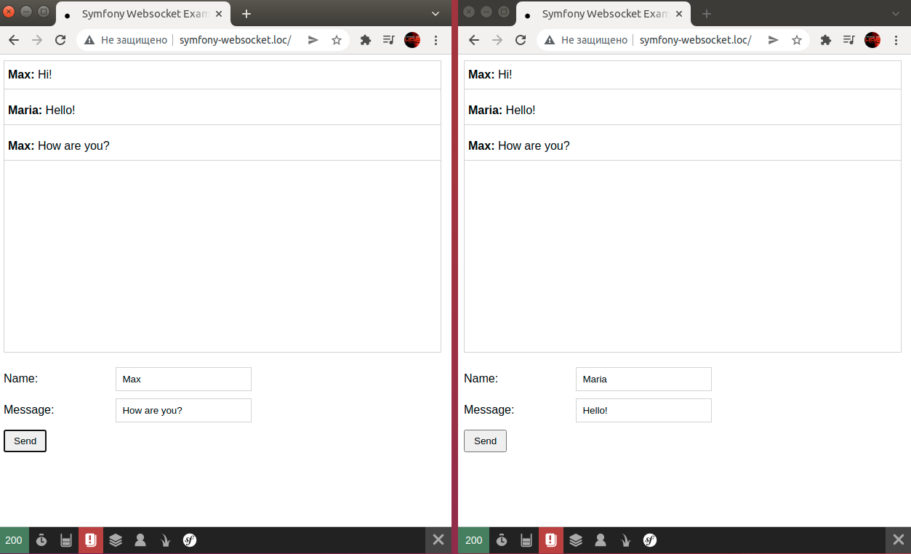

# Пример использования вебсокетов в php

Данный проект – это пример использования вебсокетов в php, на фреймворке Symfony, на примере функционала простейшего
чата.

Пример взят из [этого руководства](https://rojas.io/symfony-5-websockets-tutorial/) – мне понравился этот пример и решил 
сохранить его у себя как отдельный мини-проект.

## Установка

Переходим в каталог /var/www:

`cd /var/www/`

Клонируем проект с github:

`git clone https://github.com/WalkWeb/Symfony-Websocket-Example.git symfony-websocket.loc`

Переходим в созданный каталог с проектом:

`cd symfony-websocket.loc/`

Устанавливаем все необходимые зависимости:

`composer install`

Запускаем встроенный в php web-сервер:

`cd public`
`php -S localhost:8000`

После чего в отдельном терминале остается запустить команду, которая будет принимать вебсокетные соединения:

`php bin/console run:websocket-server`

## Использование

Откройте два окна с url `http://localhost:8000/` и отправьте какие-нибудь сообщения. Вы увидите, что они автоматически 
появляются в 
другом окне:

